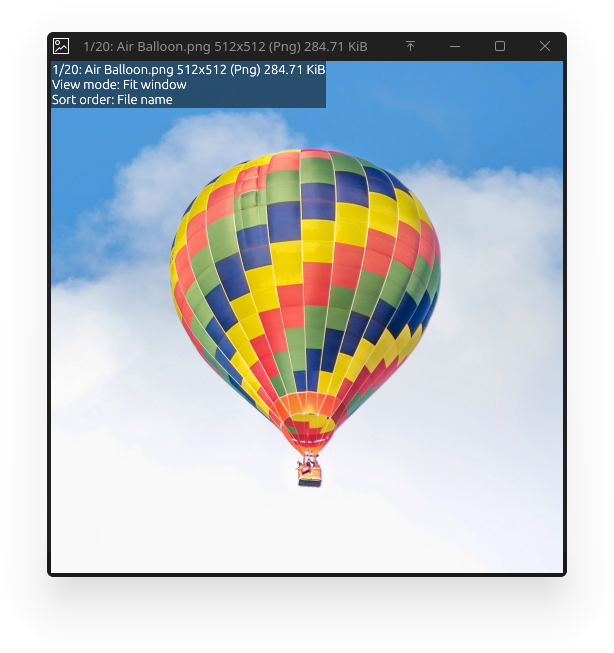

# Ziv

Ziv (Zenithsiz's Image Viewer) is an image viewer/video player designed to run smoothly when browsing large directories and with slow IO.

Heavily inspired by [qimgv](http://github.com/easymodo/qimgv)

## Features

- Displaying images (Png, Jpeg, Gif, Webp, and [others](https://docs.rs/image/0.25.9/image/enum.ImageFormat.html))

- Playing video (Using any format supported by `ffmpeg`/`libavcodec`)

- Directory view

- Fast startup

- User interface never blocks on IO, making it snappy even while loading

## Images

Images taken from an arch kde `plasma-workspace` installation in `/usr/share/plasma/avatars/photos/`.

### Image viewer



### Directory view


## Configuration

See [`config.toml`](config.toml) for the default configuration, including all shortcuts

## Installation

[//]: <> (TODO: Add more installation methods, including ones with desktop files)

### `crates.io`

This project is available at [crates.io](crates.io), meaning you can install it with cargo:

```sh
cargo install ziv
```

Note that this will only install the binary itself, without any desktop support.

### Github

Github releases are also provided in the form of standalone binaries

### Building from source

To build and install the project, first clone it, then use `cargo install`:

```sh
git clone https://github.com/Zenithsiz/ziv
cd ziv
cargo install --path ziv
```
